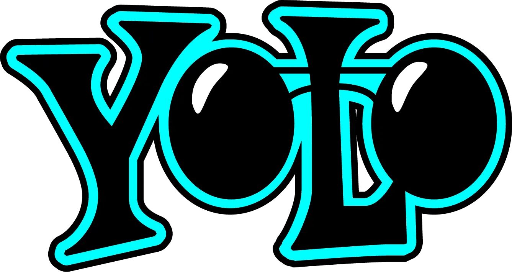

# DAY 5 RANGKUMAN STUDY NOTES BASCORRO INTERNSHIP

14 November 2024

## YOLO Course

This meeting discusses object detection using YOLOv5

Data Material

https://app.roboflow.com/login

https://colab.research.google.com/github/roboflow-ai/yolov5-custom-training-tutorial/blob/main/yolov5-custom-training.ipynb

Reference

https://youtu.be/NenFL5EgY_o?si=rFpVqzqZ64uxuvjE

https://youtu.be/rZyY2pNzypQ?si=2pk6Wl-KN0KtCtTQ

### ELI5

You Only Look Once (YOLO)

YOLO stands for **"You Only Look Once,"** and it's a type of computer vision model used to find and label objects in images or videos very quickly. Here’s a simple breakdown:

1. **One Look, All the Info**: Instead of scanning the image over and over, YOLO looks at the image once and divides it into a grid. Each grid cell looks to see if there’s an object in it.

2. **Classifying and Locating**: If it detects an object in a grid cell, it tries to figure out _what_ the object is (like "cat" or "car") and _where_ it is (the exact position and size).

3. **Bounding Boxes**: For every object it finds, YOLO draws a "bounding box" around it, which is just a rectangle that shows the object’s location.

4. **Fast and Efficient**: YOLO is designed to be super fast. It can work in real-time, which means it’s fast enough to be used in things like self-driving cars, security cameras, or live-streaming apps.

So, in short, YOLO is a fast way for computers to see and identify objects in images or videos at lightning speed—just by looking once!

paper :
https://community.ultralytics.com/t/the-original-yolo-publications/58
https://arxiv.org/pdf/1506.02640
