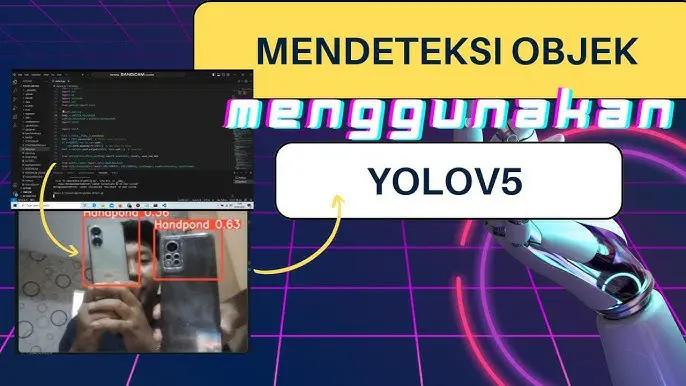

https://trello.com/c/QMPGbXy7/17-object-detection-using-yolov5

# Object Detection Using YOLOv5

To all interns, in this individual assignment, participants are required to create a dataset on roboflow, training using google collab and running the detection program on the link that has been given.

Participants are required to be able to detect objects in the form of balls, goalposts and field lines.
