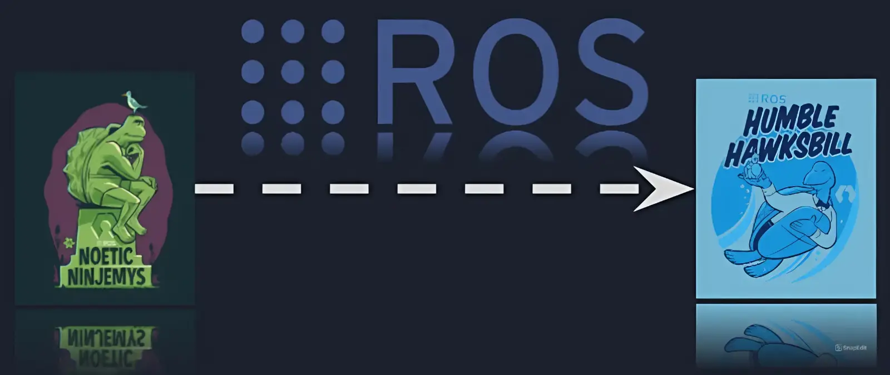

https://trello.com/c/f7nOWBAr/8-ros1-to-ros2-migration-project

# ROS1 to ROS2 Migration Project

This time you will make a project of migration ROS1 Noetic into ROS2 Humble. We will give you a ROS1 workspace below and your task is to make a version of ROS2 workspace. There are Python and C++ programming language you can freely choose to migrate. So, before you work on this project, make sure to learn about ROS1 and ROS2 fundamental first.

Furthermore, submit your ROS2 migration workspace in the task submition card at the right end of this Trello workspace.

Format Submition: your_name_migrate_ws.zip

https://github.com/ProgramBascorro/Exrec_Program_Bascorro_2025

## MATERIALS

https://docs.ros.org/en/humble/How-To-Guides/Migrating-from-ROS1.html

---

https://docs.ros.org/en/humble/How-To-Guides/Migrating-from-ROS1/Migrating-Package-XML.html

-> The page guides migrating a ROS package's `package.xml` file from format 1 to format 2, required in ROS 2. Key steps include:

- Updating the `<package>` tag with `format="2"`.
- Replacing `<run_depend>` with `<build_export_depend>` or `<exec_depend>`.
- Adjusting test-only dependencies to `<test_depend>`.
- Using `<doc_depend>` for documentation dependencies.
- Simplifying dependencies using `<depend>` instead of multiple tags.

Testing the updated package ensures correctness. For more details, visit the [official documentation](https://docs.ros.org/en/humble/How-To-Guides/Migrating-from-ROS1/Migrating-Package-XML.html).

---

https://docs.ros.org/en/humble/How-To-Guides/Migrating-from-ROS1/Migrating-Launch-Files.html

-> To migrate ROS 1 launch files to ROS 2:

1. Use Python or XML for ROS 2 launch files.
2. Replace `<node>` with `Node` (Python) or `<node>` (XML), using `package` and `executable` attributes.
3. Use `param` for parameters and environment variables.
4. Update group tags (`<group>` → `GroupAction` or `<group>`) to handle namespaces and remapping.
5. Replace `<include>` with `IncludeLaunchDescription` or `<include>` in XML.

For details, check the [guide](https://docs.ros.org/en/humble/How-To-Guides/Migrating-from-ROS1/Migrating-Launch-Files.html).
