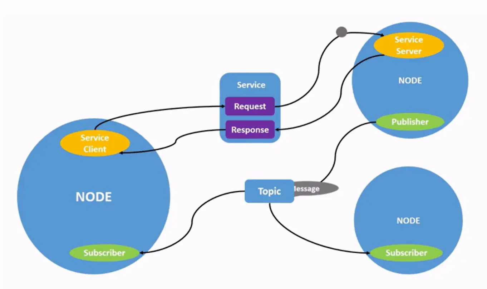

# ROS2 Nodes Project

This time you will make a project about publisher and subscriber in ROS2 Humble. You are free to make any kind of publisher and subscriber but make sure your nodes can communicate each other. You also have a freedom to choose either Python or C++ language to make your nodes. The more creative and functional the nodes, higher grade will be yours.

Lastly, submit your ROS2 workspace in the task submition card at the right end of this Trello workspace.

Format submition: your_name_ros2_ws.zip

# MATERI

In **ROS 2 (Robot Operating System 2)**, both **services** and **pub/sub (publish/subscribe)** are communication mechanisms used to pass data between different parts of a robotic system. Here’s a simple explanation of what they are and how they differ:

---

### **Publish/Subscribe (Pub/Sub):**

- **What is it?**

  - It's like a **radio station**. A **publisher** sends messages on a specific "topic" (like a channel), and **subscribers** listen to messages on that topic.

- **How does it work?**

  - A **publisher** keeps sending messages whenever it has new data (e.g., "sensor readings").
  - A **subscriber** waits to receive these messages whenever they're available.

- **When to use it?**
  - For continuous data streams or asynchronous communication.
  - Example: A robot's camera publishes image data, and the object-detection node subscribes to those images.

---

### **Service:**

- **What is it?**

  - It's like a **phone call**. A **client** makes a request to a **server**, and the server responds with some information or result.

- **How does it work?**

  - The **client** sends a specific request (e.g., "Turn the robot left 90 degrees").
  - The **server** receives the request, processes it, and sends back a response (e.g., "Done!").

- **When to use it?**
  - For request/response scenarios, where you need an answer or confirmation.
  - Example: Asking the robot to perform a one-time task like moving to a specific position.

---

### **Key Differences:**

| Feature                | Publish/Subscribe                           | Service                                        |
| ---------------------- | ------------------------------------------- | ---------------------------------------------- |
| **Communication type** | Continuous, one-way                         | One-time, two-way (request/response)           |
| **Use case**           | Sending ongoing data (e.g., sensor updates) | Triggering actions or requesting specific info |
| **Timing**             | No guarantee of immediate delivery          | Synchronous or immediate interaction           |
| **Examples**           | Sharing sensor data, robot state info       | Controlling motors, querying system health     |

---

### Quick Analogy:

- **Pub/Sub**: "I’m a news reporter publishing updates to anyone interested."
- **Service**: "I’m a help desk answering specific questions or fulfilling requests."
