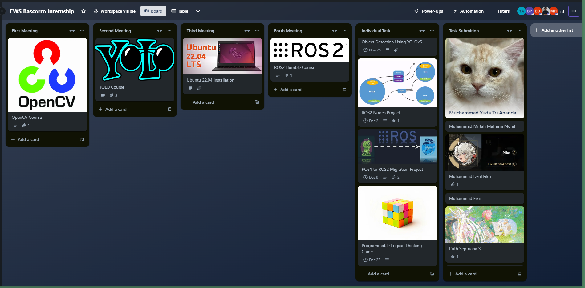

# INTERNSHIP BASCORRO STUDY NOTES, DOCUMENTATION ETC

EWS Bascorro merupakan Tim riset Humanoid Robot Sepak Bola yang berpengalaman lebih dari 5 Tahun dibawah URDC (Undip Robotic Development Center). Bersaing untuk Kontes Robot Indonesia kategori KRSBI-Humanoid (Kontes Robot Sepak Bola Humanoid) sebagai implementasi Pilar ke-1 Riset yaitu Sains dan Teknologi, perpaduan ilmu tentang Mekanika, Elektronika, Teknologi Informasi / Informatika, serta Manajemen Riset yang tiap tahunnya mampu membawa EWS Bascorro mencapai posisi 8 besar nasional dalam KRSBI-Humanoid dan penghargaan tingkat regional dalam lima tahun terakhir.

## PROGRAM DIVISION

### MOTION PROGRAM

Divisi Motion bertanggung jawab atas pergerakan robot, dengan fokus pada
gerakan yang meniru manusia seperti menendang, berdiri, dan bergerak.
Teknologi yang digunakan termasuk servo dynamixel untuk mengontrol sendi
robot. Selain itu, divisi ini menggunakan sistem operasi Linux Ubuntu dan
kerangka ROS2 untuk mengendalikan komponen seperti node, publisher, dan
subscriber dalam pemrograman gerakan robot .

### VISION PROGRAM

Divisi Vision bekerja dalam pengembangan kemampuan penglihatan robot
melalui dua sub-divisi: Computer Vision (CV) dan Algoritma. Divisi CV
mengumpulkan dan memproses data visual menggunakan alat seperti OpenCV,
YOLO, dan Roboflow. Sementara itu, sub-divisi Algoritma fokus pada
pengembangan algoritma lokalisasi dan navigasi robot, dengan menggunakan
sistem Nav2 dan ROS. Keduanya membantu robot dalam mengidentifikasi objek
dan menentukan tindakan di lapangan.
