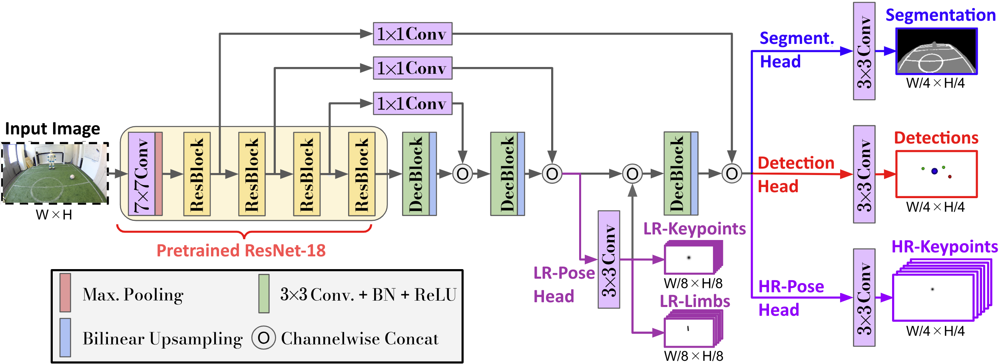
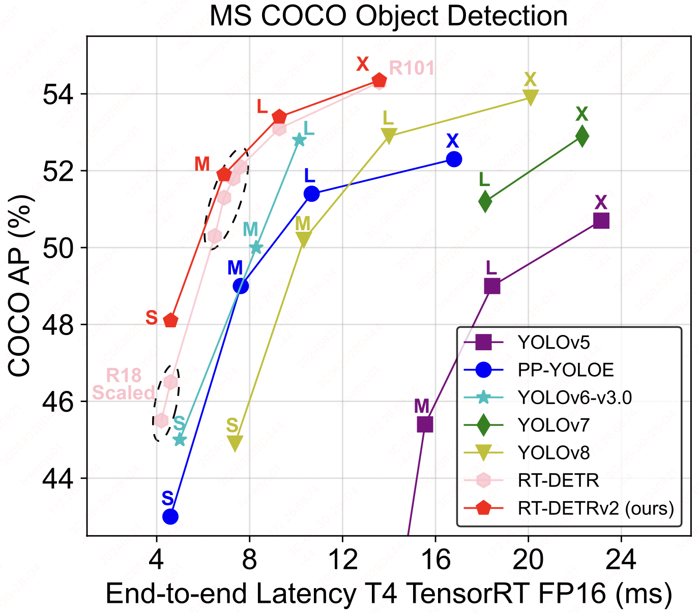
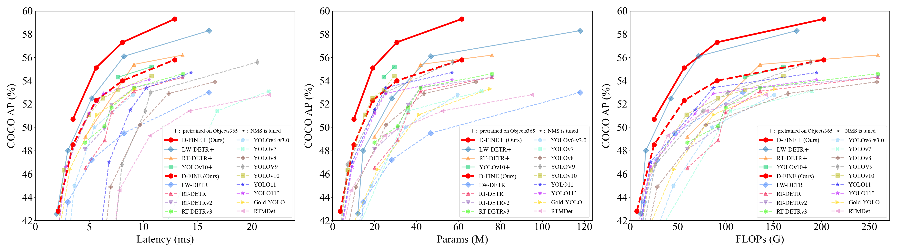

papers

Deep-learning based Visual Perception: NimbRoNet3 - https://arxiv.org/html/2401.05909v1/#S6

https://github.com/ppogg/YOLOv5-Lite

https://github.com/lyuwenyu/RT-DETR

https://github.com/Peterande/D-FINE?tab=readme-ov-file

## DATASETS

https://github.com/bit-bots/TORSO_21_dataset

https://github.com/bebetocf/ssl-dataset

https://spl.robocup.org/datasets/

---

https://www.youtube.com/watch?v=FhJwdtnVusY
