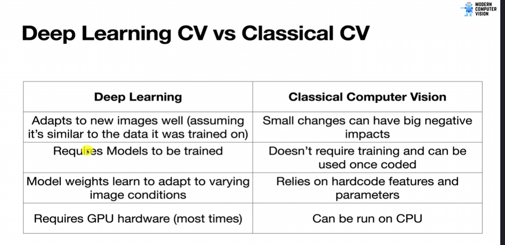
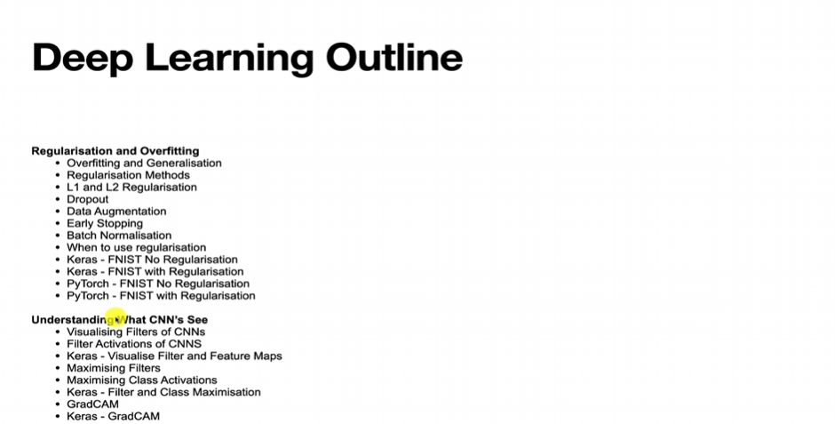
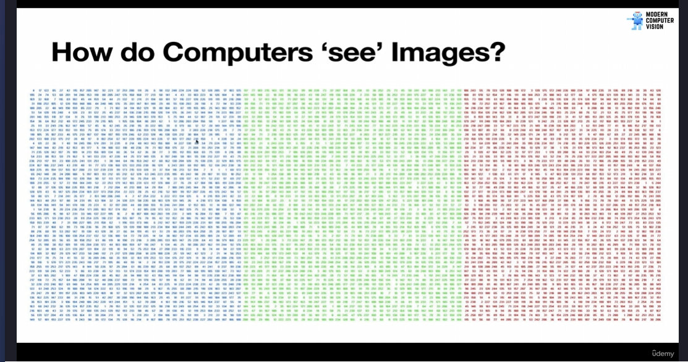

# Course Introduction

The course defines computer vision as an interdisciplinary field enabling computers to understand images and videos. It clarifies that computer vision is a subset of Artificial Intelligence, incorporating fields like robotics, machine learning, deep learning, and convolutional neural networks. It also highlights the diverse range of disciplines that contribute to computer vision, including augmented reality, mathematics, physics, electrical engineering, cognitive science, image processing, and computer graphics.

The introduction showcases numerous computer vision applications, from Instagram filters and optical character recognition (OCR) to self-driving cars, sports analysis, facial recognition, image similarity, deepfakes, body pose estimation, and image generation. The possibilities of computer vision are vast and constantly expanding.

The course is divided into two main sections:

1.  **Classical Computer Vision (OpenCV):** In-depth exploration of traditional computer vision algorithms developed from the 1970s to the present.
2.  **Deep Learning:** Focuses on how deep learning has revolutionized computer vision, enabling complex image models for tasks like object detection and tracking.

# Course Overview

This section provides a detailed overview of the "Modern Computer Vision" course content.

**Fundamental Concepts:**

The course emphasizes Python as the primary programming language for computer vision due to its ease of learning, accessibility, and compatibility with leading AI libraries like PyTorch and TensorFlow. It also highlights the strong Python library support for OpenCV, which is crucial for the classical computer vision portion of the course.

**Classical vs. Deep Learning:**

- **Classical Computer Vision:** Encompasses computer vision algorithms that don't involve machine learning. These techniques, like edge detection and contouring, are foundational to understanding computer vision.
- **Deep Learning:** Revolutionized computer vision, enabling advancements in areas like image classification, object detection, and segmentation. The course attributes deep learning's success to libraries like TensorFlow and PyTorch, as well as the widespread availability of GPUs.

**Key Advantages of Deep Learning:**

- **Adaptability:** Deep learning models adapt well to new images, provided they are similar to the training data.
- **Performance:** GPUs significantly accelerate the training and execution of deep learning models.

**Classical Computer Vision Characteristics:**

- Often involves hard-coded algorithms.
- Requires manual tuning.
- Small image changes can have significant effects.
- Traditionally run on CPUs.

**Deep Learning Characteristics:**

- Requires model training.
- Benefits from GPU acceleration.

**Course Outline:**

**1. OpenCV (Classical Computer Vision):**

The OpenCV section covers a wide array of topics, including:

- Basic image processing techniques.
- Edge detection and contouring.
- Image segmentation and object detection (including Haar cascades).
- Geometric transformations and image alignment.
- Clustering and color analysis.
- Image similarity and feature matching.
- Optical flow and motion analysis.
- Facial landmark detection and recognition.
- Background removal and OCR.
- Barcode reading and YOLO integration.
- Computational photography.
- Working with video: loading, processing, streaming (USB, IP), screen capture, and YouTube integration.

**2. Deep Learning:**

The deep learning section is equally comprehensive:

- Deep dive into deep learning fundamentals and computer vision applications.
- Building CNN models using PyTorch and TensorFlow/Keras.
- Data loading, model training, and inference.
- Library comparisons and performance analysis.
- Model improvement techniques (regularization, preventing overfitting).
- CNN visualization and understanding.
- Advanced CNN architectures (ResNet, DenseNet, EfficientNet).
- PyTorch Lightning for multi-GPU training and transfer learning.
- Transfer learning in TensorFlow/Keras and PyTorch.
- Google Deep Dream and Neural Style Transfer.
- Generative Adversarial Networks (GANs) for image generation.
- Siamese networks and facial recognition (using Deepface).
- Object detection (history, SSD, YOLOv3, v4, v5).
- Deep segmentation (U-Net, SegNet, Mask R-CNN).
- Deep tracking (DeepSORT).
- Miscellaneous tutorials: Deepfakes, Vision Transformers, depth estimation, image similarity, image captioning, video classification, point cloud processing, 3D image classification (CT scans, X-rays), OCR model for CAPTCHAs, web app development (REST API, Flask).

The course overview emphasizes the breadth and depth of the material covered, promising a thorough understanding of both classical and deep learning approaches in computer vision. The next section will begin with a basic introduction to computer vision.

# What Makes Computer Vision So Hard?

This section explores the challenges that make computer vision a complex field, despite our brains' seemingly effortless ability to process visual information.

**The Brain's Advantage:**

Our brains, with their highly developed visual cortex, excel at vision and other tasks like speech and reading. They possess a general-purpose computer vision capability that far surpasses current artificial systems. We effortlessly understand complex scenes, recognize objects, and interpret their relationships, thanks to our built-in knowledge and experience. Computers, on the other hand, lack this general knowledge and require explicit programming for each specific task.

**Challenges in Computer Vision:**

Several factors contribute to the difficulty of computer vision:

1.  **Camera Limitations:** Physical cameras have limitations in terms of noise, granularity, and resolution compared to human eyes.

2.  **Viewpoint Variations:** Objects can appear drastically different from various angles, making recognition challenging for computer vision models. Our brains easily recognize the same object despite changes in perspective.

3.  **Changing Lighting Conditions:** Variations in lighting can drastically alter the appearance of a scene, impacting a computer's ability to interpret it.

4.  **Scaling Issues:** The size of an object in an image can affect its recognition. Objects at different scales can appear as distinct entities to a computer vision algorithm.

5.  **Natural Non-Rigid Deformations:** Objects, especially living beings, can exhibit a wide range of poses and deformations. A dog, for example, can sit, stand, or crouch, yet we still recognize it as a dog. Computers need to be trained on numerous examples to account for these variations.

6.  **Occlusion:** When part of an object is hidden by another, it becomes challenging for computer vision algorithms to recognize the complete object.

7.  **Clutter:** Scenes with many objects and distractions make it difficult to isolate and identify specific items.

8.  **Object Class Variation:** Objects within the same category can have significant variations in appearance (e.g., different types of beds). Computers must learn to recognize these variations within a class.

9.  **Ambiguous Images:** Optical illusions and images with multiple interpretations can confuse computer vision systems.

These challenges highlight the complexity of vision and the difficulties in creating computer vision systems that can match human capabilities. The next section will delve into the fundamental nature of images, which is crucial for understanding how computer vision works.

# What are Images?

This section explains the digital representation of images and how they are stored in computers.

**Digital Representation:**

Computers see images as arrays of numbers, with each number representing the intensity of a color at a specific pixel. The RGB (Red, Green, Blue) color model is commonly used, where each pixel has three values (one for each color). These values range from 0 to 255, representing the intensity of that color. For example, (255, 0, 0) would be bright red, while (0, 0, 0) would be black.

**What are Images?**

Images are 2D representations of the visible light spectrum, a small portion of the electromagnetic spectrum that our eyes can perceive. Each pixel in an image is a combination of red, green, and blue light intensities, creating the various colors we see.

**Image Creation:**

Images are created by focusing light reflected from an object onto a photosensitive sensor (or film in traditional photography). Lenses are used to focus the light and control zoom and aperture, ensuring a sharp image.

**Color Representation in OpenCV:**

OpenCV uses the BGR (Blue, Green, Red) color format, which is similar to RGB but with the color channels reversed. For example, yellow is created by mixing red and green light, represented as (0, 255, 255) in BGR.

**Image Storage in Computers:**

- **Variables:** Computers use variables to store data. These can be integers, strings (text), or arrays.
- **Arrays:** Arrays are containers that hold multiple values. One-dimensional arrays are like a list of values, while two-dimensional arrays form a grid.
- **Three-Dimensional Arrays for Color Images:** Color images are stored as three-dimensional arrays. Each element in the array represents a pixel, and each pixel has three values (B, G, R) defining its color.
- **Two-Dimensional Arrays for Grayscale Images:** Grayscale images are stored as two-dimensional arrays, where each element represents a pixel's brightness. Values typically range from 0 (black) to 255 (white).

**Image File Formats:**

- **Raster Images:** These are pixel-based images with a fixed resolution. Common formats include JPEG (.jpg, .jpeg), PNG (.png), GIF (.gif), TIFF (.tif, .tiff). These formats are resolution-dependent, meaning their quality can degrade when scaled up.
- **Vector Images:** These images are defined by mathematical equations and are resolution-independent. Common formats include SVG (.svg), PDF (.pdf). Vector images can be scaled without losing quality. This course primarily focuses on raster images.
