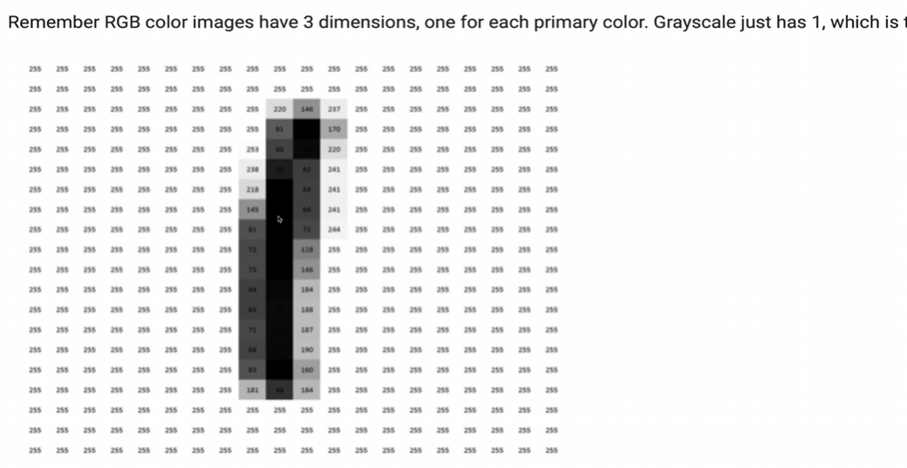

# Getting Started with OpenCV

This section guides you through the initial steps of using OpenCV in a Google Colab environment.

**Setting Up:**

The code for this course is organized into two main folders: "OpenCV" and "Deep Learning." This lesson focuses on the "OpenCV" folder, which contains various Python notebooks (.ipynb files). These notebooks are interactive coding environments that allow you to execute code in blocks (cells).

**Opening a Notebook:**

Open the "Getting Started" notebook. Each notebook begins with a description of the lesson's topics, making it easy to understand the content at a glance.

**Importing OpenCV:**

The first step is to import the OpenCV library:

```python
import cv2
```

Google Colab comes with many pre-installed libraries, including OpenCV. If you needed to install it, you could use `!pip install opencv-python` in a code cell.

**Checking OpenCV Version:**

You can check the installed OpenCV version:

```python
print(cv2.__version__)
```

**Downloading Images:**

The code uses `gdown` and `unzip` to download and extract a zip file containing test images from the instructor's Google Drive. Don't worry about the specifics of these commands for now. The important thing is that the images are downloaded and available for use.

**Loading Images:**

File paths are crucial. Make sure you correctly specify the path to your image files. Here's how to load an image using OpenCV:

```python
image = cv2.imread("flowers.jpeg")  # Replace with your image path
```

**Displaying Images (using Matplotlib):**

Matplotlib is used to display images:

```python
import matplotlib.pyplot as plt

# OpenCV uses BGR, Matplotlib uses RGB, so we need to convert
image_rgb = cv2.cvtColor(image, cv2.COLOR_BGR2RGB)
plt.imshow(image_rgb)
plt.title("Flowers")
plt.show()
```

**Explanation of Color Conversion:**

OpenCV reads images in BGR (Blue, Green, Red) format, while Matplotlib displays them in RGB (Red, Green, Blue) format. The `cv2.cvtColor()` function is used to convert the image from BGR to RGB before displaying it with Matplotlib.

**Creating a Helper Function for Displaying Images:**

A helper function `show()` is created to simplify image display:

```python
def show(image, title=""):
    image_rgb = cv2.cvtColor(image, cv2.COLOR_BGR2RGB)
    plt.imshow(image_rgb)
    plt.title(title)
    plt.show()

# Example usage:
show(image, "My Image")
```

**Saving Images:**

Images can be saved using `cv2.imwrite()`:

```python
cv2.imwrite("output.png", image)  # Saves as PNG
cv2.imwrite("output.jpg", image)  # Saves as JPEG
```

**Image Dimensions:**

Images are stored as NumPy arrays. The `shape` attribute of the array gives you the image's dimensions:

```python
print(image.shape)  # Output: (height, width, channels)
height, width, channels = image.shape
print(f"Height: {height}, Width: {width}, Channels: {channels}")
```

- **Height:** Number of rows of pixels.
- **Width:** Number of columns of pixels.
- **Channels:** Number of color channels (3 for color images, 1 for grayscale).

**Summary of the Lesson:**

This lesson covered the basics of working with OpenCV:

- Importing the OpenCV library.
- Loading images.
- Displaying images using Matplotlib (with color conversion).
- Saving images.
- Getting image dimensions (height, width, channels).

# Grayscaling Images

This lesson demonstrates how to convert a color image to grayscale using OpenCV.



**Importing Libraries and Helper Function:**

The lesson begins by importing the necessary libraries (OpenCV and Matplotlib) and defining a helper function `show()` to display images. The `show()` function is enhanced to handle figure size and maintain aspect ratio when displaying images using Matplotlib.

**Loading and Displaying a Color Image:**

An image (Star Beach in Trinidad and Tobago) is loaded and displayed using the `show()` function. The `size` argument in the function call controls the displayed image size.

**Converting to Grayscale:**

The core of the lesson is the conversion to grayscale using `cv2.cvtColor()`:

```python
gray_image = cv2.cvtColor(image, cv2.COLOR_BGR2GRAY)
show(gray_image, "Converted to Grayscale")
```

`cv2.COLOR_BGR2GRAY` specifies the color conversion from BGR (OpenCV's default) to grayscale.

**Understanding Grayscale:**

Grayscale images have only one color channel, representing the intensity of gray (from black to white). While color images use three channels (Red, Green, Blue), grayscale images represent each pixel with a single value. OpenCV calculates the grayscale value by averaging the red, green, and blue components of each pixel in the original color image. The values range from 0 (black) to 255 (white).

**Image Dimensions (Shape):**

The shape of the grayscale image is printed. While the height and width remain the same, the number of channels (depth) is now 1, reflecting the single grayscale channel.

**Summary:**

This lesson showed how to convert a color image to grayscale using `cv2.cvtColor()` with the `cv2.COLOR_BGR2GRAY` conversion code. Grayscaling is a fundamental operation in computer vision, often used as a preprocessing step for other image processing tasks. The lesson emphasized the importance of understanding how grayscale images are represented (single channel) and how to use the `cv2.cvtColor()` function effectively.

# Color Spaces

This lesson explores color spaces, focusing on RGB and HSV, and how to manipulate them using OpenCV.

**Setup:**

The lesson starts by importing necessary libraries (OpenCV, Matplotlib) and downloading images, similar to previous lessons.

**RGB Color Channels:**

The code demonstrates how to separate and visualize individual RGB channels of an image:

```python
blue, green, red = cv2.split(image)

print(blue.shape)  # Output: (height, width) - 2D array

# Create blank images with the same size as the original
zeros = np.zeros_like(image)

blue_image = cv2.merge([blue, zeros, zeros])  # Only blue channel
green_image = cv2.merge([zeros, green, zeros]) # Only green channel
red_image = cv2.merge([zeros, zeros, red])    # Only red channel

show(blue_image, "Blue Channel")
show(green_image, "Green Channel")
show(red_image, "Red Channel")
```

`cv2.split()` separates the image into its BGR components. Each channel is a 2D array (grayscale image). To visualize a single channel, we create a blank image (filled with zeros) and merge the desired channel with two zero channels.

**Merging RGB Channels:**

The lesson shows how to merge the individual channels back into a color image:

```python
merged_image = cv2.merge([blue, green, red])
show(merged_image, "Merged Image (Original)")
```

**Modifying RGB Values:**

The code demonstrates how to modify the blue channel's intensity and observe the effect on the image:

```python
image_modified = image.copy()
image_modified[:, :, 0] = image_modified[:, :, 0] + 100 # Increase blue intensity

show(image_modified, "Modified Image (Increased Blue)")
```

Adding a value to the blue channel increases its intensity. The lesson explains that the resulting color changes (e.g., the appearance of yellow) are due to the mixing of RGB components.

**HSV Color Space:**

The lesson introduces the HSV (Hue, Saturation, Value) color space as an alternative to RGB. It uses a color wheel analogy to explain the three components:

- **Hue:** Represents the color type (e.g., red, green, blue).
- **Saturation:** Represents the color's intensity or purity.
- **Value:** Represents the brightness of the color.

**Converting to HSV:**

The code shows how to convert an image from BGR to HSV:

```python
hsv_image = cv2.cvtColor(image, cv2.COLOR_BGR2HSV)
show(hsv_image, "HSV Image (Incorrect Display)") # Incorrect display
```

The image looks distorted because Matplotlib's `imshow()` function expects RGB images, not HSV.

**Converting HSV back to RGB for Display:**

To display the HSV image correctly using Matplotlib, it needs to be converted back to RGB:

```python
hsv_image_rgb = cv2.cvtColor(hsv_image, cv2.COLOR_HSV2RGB)
show(hsv_image_rgb, "HSV Image (Correct Display)")
```

**Visualizing HSV Components:**

The lesson demonstrates how to extract and visualize the individual H, S, and V components:

```python
h, s, v = cv2.split(hsv_image)

show(h, "Hue")
show(s, "Saturation")
show(v, "Value")
```

Each component is displayed as a grayscale image, showing the intensity variations of that specific HSV property.

**Summary:**

This lesson covered:

- Separating and visualizing individual RGB channels.
- Merging RGB channels.
- Modifying RGB values and observing the color changes.
- Introduction to the HSV color space and its components (Hue, Saturation, Value).
- Converting between BGR and HSV color spaces.
- Visualizing individual HSV components.
