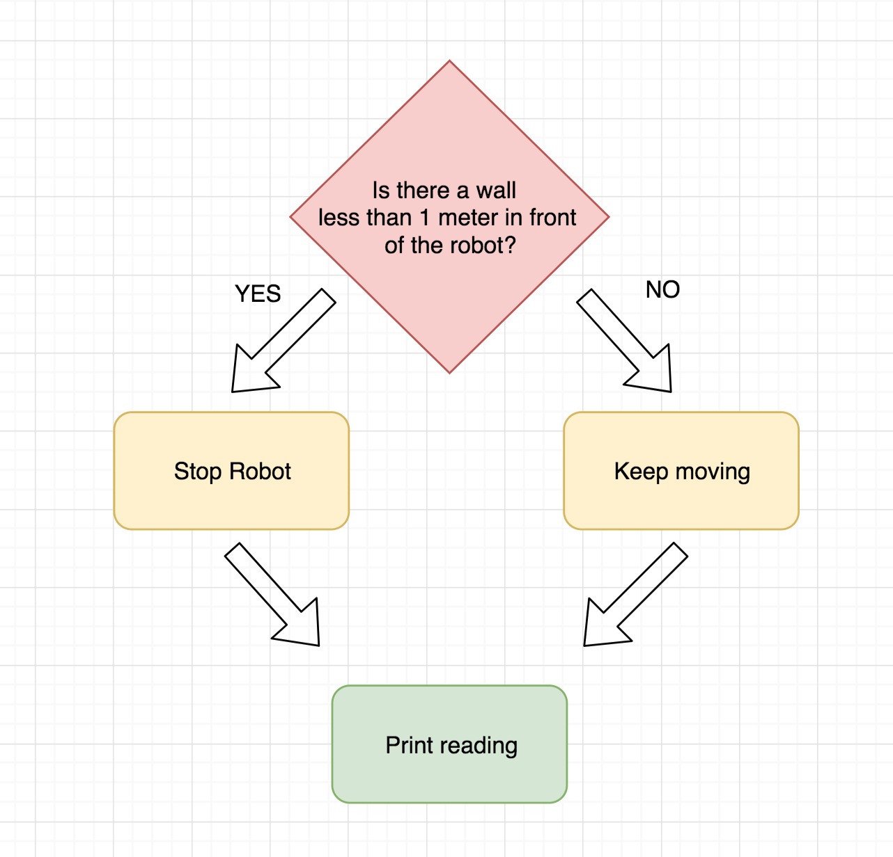
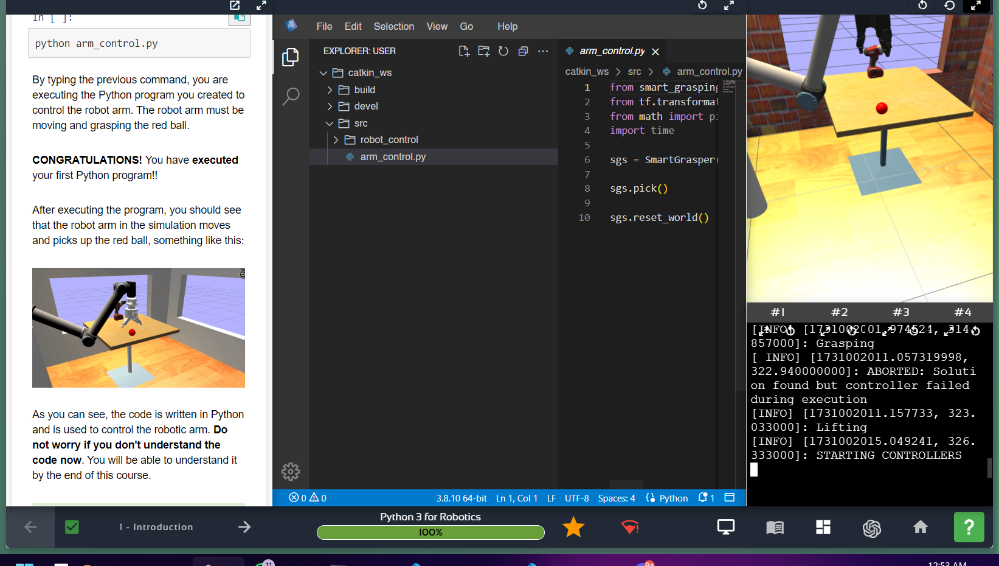

# DAY 1 RANGKUMAN STUDY NOTES BASCORRO INTERNSHIP

Senin 4 November 2024

https://app.theconstruct.ai/courses/

## Linux for Robotics Course

### UNIT 1 INTRODUCTION



#### Unit 1.1 Introduction to the Course

Tujuan Kursus Kursus ini mengajarkan Linux, sistem operasi open source yang luas penggunaannya di berbagai teknologi, termasuk dalam pengembangan robot dengan ROS yang membutuhkan Linux sebagai OS utama.

#### Unit 1.2 Why You Need To Learn Linux?

Linux sangat dibutuhkan dalam pengembangan robotika, karena sebagian besar robot menggunakan ROS yang berbasis Linux. Selain itu, Linux digunakan secara luas di berbagai perangkat dan sistem besar seperti server internet (Google, Facebook), superkomputer, sistem hiburan pesawat, televisi pintar, hingga ponsel Android. Linux juga menawarkan fleksibilitas dan keamanan tinggi, serta dikembangkan secara kolaboratif oleh komunitas.

#### Unit 1.3 Bash Script Demo

peserta menjalankan bash script untuk berinteraksi dengan robot BB8. Bash script adalah alat penting di Linux untuk membuat program sederhana. Pada demo ini, peserta akan diperkenalkan dengan Shell, antarmuka di Linux untuk menjalankan perintah.

Web Shell adalah Shell Linux biasa yang dijalankan melalui browser web (karena kursus ini berbasis web).

Jadi, apa itu Linux Shell?


Shell adalah alat yang memungkinkan Anda berkomunikasi dengan sistem Linux untuk memberi instruksi (dengan mengirim perintah). Di layar kursus, Anda akan menemukan Web Shells (lihat gambar di atas).


Ini dikenal sebagai _prompt_ di Shell, yang menampilkan informasi dasar seperti nama pengguna saat ini (misalnya, _user_) atau jalur direktori tempat Anda berada (akan dipelajari lebih lanjut di kursus). Anda juga akan melihat adanya blok putih yang berkedip, menandakan bahwa Shell aktif dan siap menerima perintah Anda!

**Linux Prompt**

1. **Perintah `cd`**

   - **Fungsi**: Mengubah direktori saat ini di Shell.
   - **Penggunaan**: Ketik `cd` diikuti dengan jalur direktori untuk pindah ke direktori tertentu.
   - **Contoh**: `cd /home/simulations/public_sim_ws/src/all/ros_basics_examples/linux_demo/`

2. **Menjalankan Bash Script (Contoh: `./demo.sh rotate`)**

   - **Fungsi**: Menjalankan program atau perintah yang terdapat dalam script bash.
   - **Penggunaan**: Ketik `./` diikuti dengan nama script dan argumen (jika ada) untuk menjalankan perintah.
   - **Contoh**: `./demo.sh rotate` akan membuat robot BB8 berputar.

3. **Menghentikan Script dengan `Ctrl + C`**
   - **Fungsi**: Menghentikan eksekusi script yang sedang berjalan di Shell.
   - **Penggunaan**: Tekan tombol `Ctrl` dan `C` secara bersamaan untuk menghentikan script yang aktif.
   - **Catatan**: Pastikan fokus berada di Shell tempat script berjalan agar perintah ini berfungsi.

### Unit 2 LINUX ESSENTIALS

1. **Mengenal Sistem Berkas di Linux**  
   Keterampilan dasar yang penting di Linux adalah navigasi folder dan berkas. Sistem Linux terdiri dari:

   - **Berkas**: Menyimpan data.
   - **Folder (Direktori)**: Mengorganisasi berkas dan folder lain tanpa mengonsumsi banyak ruang.

2. **Perintah Penting dalam Navigasi dan Pengelolaan Berkas**

   - **`cd`**: Pindah ke direktori tertentu. Contoh: `cd /home/user/catkin_ws/src/linux_course_files/move_bb8_pkg/src/` akan membawa kita ke folder **src**.
   - **`pwd`**: Menampilkan direktori saat ini (Print Working Directory). Berguna untuk mengetahui lokasi kita di dalam sistem berkas.
   - **`ls`**: Menampilkan isi direktori. Gunakan `ls --help` untuk melihat informasi lebih lanjut tentang opsi perintah ini.
   - **Berkas Tersembunyi**: Berkas yang diawali dengan titik (.) seperti **.bashrc** tidak terlihat dengan `ls` biasa. Gunakan `ls -a` untuk menampilkan berkas tersembunyi.
   - **`mkdir`**: Membuat direktori baru. Contoh: `mkdir new_folder` akan membuat folder bernama **new_folder**.
   - **`touch`**: Membuat berkas kosong baru. Contoh: `touch new_file.txt` akan membuat berkas bernama **new_file.txt**.

3. **Pengeditan Berkas dan Manajemen Konten**

   - **`vi`**: Editor teks visual untuk mengedit berkas langsung di terminal. Jalankan `vi nama_berkas` untuk membuka dan mengedit berkas.
   - **`mv`**: Memindahkan atau mengubah nama berkas atau direktori. Contoh: `mv old_file.txt new_location/` akan memindahkan **old_file.txt** ke **new_location**.
   - **`cp`**: Menyalin berkas atau direktori. Contoh: `cp file.txt copy_of_file.txt` akan membuat salinan dari **file.txt** dengan nama **copy_of_file.txt**.
   - **`rm`**: Menghapus berkas. Gunakan `rm file.txt` untuk menghapus **file.txt**. Untuk folder, gunakan `rm -r nama_folder`.

4. **Menjalankan Program Kontrol BB8**
   ```bash
   python bb8_keyboard.py
   ```
   Perintah ini memulai skrip untuk mengontrol BB8.

### Unit 3 ADVANCED UTILITIES

#### Unit 3.1 Permissions

Meskipun sistem Linux memiliki fitur keamanan bawaan yang baik, kerentanan bisa muncul dari pengaturan izin file yang tidak tepat. Kesalahan ini dapat memberi akses tidak sah ke file atau direktori.

##### **Memeriksa Izin File**

1. **Perintah `ls -la`**:

   - Menampilkan informasi dasar file atau folder, termasuk izin, tanggal pembuatan, dan lainnya.
   - Contoh output:
     ```
     -rw-r--r-- 1 user user 2203 Jul 23 23:26 move_bb8_square.py
     ```
   - Karakter pertama menunjukkan izin file, seperti:
     - `r` untuk membaca (read)
     - `w` untuk menulis (write)
     - `x` untuk menjalankan (execute)
     - `-` menunjukkan izin yang tidak diterapkan.

2. **Kelompok Izin Berdasarkan Pengguna**:
   - **Pemilik (Owner)**: Tiga karakter pertama (mis. `rw-`).
   - **Grup (Group)**: Tiga karakter tengah (mis. `r--`).
   - **Semua Pengguna (Others)**: Tiga karakter terakhir (mis. `r--`).

##### **Mengubah Izin dengan Perintah `chmod`**

1. **Menambahkan Izin Eksekusi**:

   ```bash
   chmod +x move_bb8_square.py
   ```

   - Menambahkan izin eksekusi (`x`) ke semua kelompok pengguna.

2. **Struktur Perintah `chmod`**:
   ```bash
   chmod [kelompok pengguna] [izin yang ingin diubah] [nama file]
   ```
   - Contoh:
     - Memberi izin menulis hanya untuk grup:
       ```bash
       chmod g+w move_bb8_square.py
       ```
     - Menghapus izin eksekusi untuk grup dan pengguna lain:
       ```bash
       chmod go-x move_bb8_square.py
       ```

##### **Metode Biner untuk Izin**

- Setiap izin memiliki nilai numerik:
  - `r = 4`, `w = 2`, `x = 1`
- Kombinasi izin dinyatakan dengan angka:
  - **Contoh**: Izin `rwx` untuk pemilik, `r` untuk grup, dan tanpa izin untuk lainnya:
    ```bash
    chmod 740 move_bb8_square.py
    ```

#### Unit 3.2 Bash scripts

- Script Bash adalah file teks berisi perintah Linux, dapat dijalankan untuk otomatisasi.
- Struktur dasar:
  ```bash
  #!/bin/bash
  echo "Halo, Dunia!"
  ```
- **Eksekusi Script**: Pastikan file memiliki izin eksekusi (`chmod +x script.sh`) dan jalankan dengan `./script.sh`.
- **Contoh Sederhana**:
  - Script untuk mengubah izin dan menampilkan daftar file:
    ```bash
    #!/bin/bash
    cd ~/my_scripts
    ls -la
    chmod 777 move_bb8_square.py
    ls -la
    ```

3. **Bash Script Parameters (Parameter pada Bash Script)**

   - Dapat menerima argumen dari command line, seperti `$1`, `$2`, dsb.
   - Contoh:
     ```bash
     #!/bin/bash
     echo "Nama file adalah $1"
     ```
     Jalankan: `./script.sh file.txt`, output: `Nama file adalah file.txt`.

4. **.bashrc**

   - File konfigurasi untuk shell Bash yang dieksekusi setiap kali terminal dibuka.
   - Digunakan untuk mendefinisikan alias, variabel, dan pengaturan lain yang sering dipakai.
   - Contoh menambahkan alias:
     ```bash
     alias ll='ls -la'
     ```

5. **Environment Variables (Variabel Lingkungan)**

   - Variabel sistem yang digunakan untuk menyimpan informasi sistem seperti `PATH`.
   - **export** digunakan untuk menetapkan variabel lingkungan:
     ```bash
     export MY_VAR="Halo"
     ```

6. **grep**

   - Digunakan untuk mencari teks di dalam file atau output.
   - Contoh: `grep 'hello' file.txt` akan mencari kata “hello” dalam `file.txt`.
   - **Pipe** (`|`) digunakan untuk menyalurkan output dari satu perintah ke perintah lain, sering digunakan bersama `grep`.
     ```bash
     ls -la | grep '.txt'
     ```

7. **Pipe (|)**
   - Memungkinkan pengalihan output dari satu perintah ke perintah lain.
   - Contoh:
     ```bash
     ps aux | grep 'bash'
     ```
     Akan menampilkan proses yang berisi kata "bash".

### Unit 4 ADVANCED UTILITIES PART 2

#### Unit 4.1 Linux Processes

1. **Pengertian Proses di Linux**:

   - **Proses** adalah program yang sedang berjalan di sistem Linux.
   - Proses terdiri dari instruksi program, data dari file, atau input dari pengguna.

2. **Jenis-Jenis Proses di Linux**:

   - **Foreground Process**: Proses yang dijalankan dan dikontrol melalui terminal, membutuhkan koneksi pengguna.
   - **Background Process**: Proses yang berjalan tanpa interaksi terminal, tidak membutuhkan input pengguna.

3. **Melihat Proses yang Berjalan**:
   - **htop**: Menampilkan detail proses dalam tampilan grafis yang mencakup penggunaan CPU, memori, dan statistik proses secara real-time.
   - **ps faux**: Menampilkan daftar proses secara ringkas, ideal untuk pengguna pemula.
