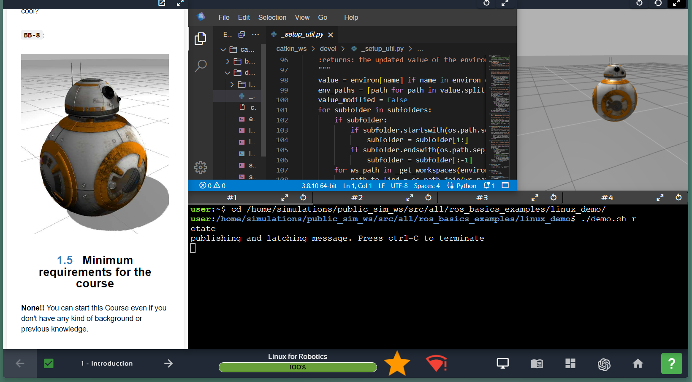
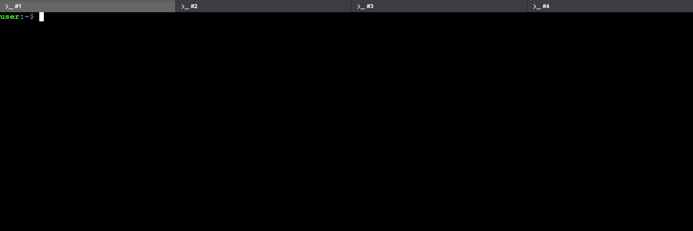
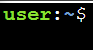

# DAY 1 RANGKUMAN STUDY NOTES BASCORRO INTERNSHIP

Senin 4 November 2024
https://app.theconstruct.ai/courses/

# Table of Contents

- [DAY 1 RANGKUMAN STUDY NOTES BASCORRO INTERNSHIP](#day-1-rangkuman-study-notes-bascorro-internship)
  - [Install Linux / WSL (Windows Subsystem for Linux)](#install-linux--wsl-windows-subsystem-for-linux)
  - [Linux for Robotics Course](#linux-for-robotics-course)
    - [UNIT 1 INTRODUCTION](#unit-1-introduction)
      - [Unit 1.1 Introduction to the Course](#unit-11-introduction-to-the-course)
      - [Unit 1.2 Why You Need To Learn Linux?](#unit-12-why-you-need-to-learn-linux)
      - [Unit 1.3 Bash Script Demo](#unit-13-bash-script-demo)
      - [SOAL](#soal-unit-1)
    - [Unit 2 LINUX ESSENTIALS](#unit-2-linux-essentials)
      - [SOAL](#soal-unit-2)
    - [Unit 3 ADVANCED UTILITIES](#unit-3-advanced-utilities)
      - [Unit 3.1 Permissions](#unit-31-permissions)
        - [Memeriksa Izin File](#memeriksa-izin-file)
        - [Mengubah Izin dengan Perintah chmod](#mengubah-izin-dengan-perintah-chmod)
      - [Unit 3.2 Bash Scripts](#unit-32-bash-scripts)
      - [SOAL](#soal-unit-3)
    - [Unit 4 ADVANCED UTILITIES PART 2](#unit-4-advanced-utilities-part-2)
      - [Unit 4.1 Linux Processes](#unit-41-linux-processes)
      - [4.2 SSH protocol](#42-ssh-protocol)
      - [SOAL](#soal-unit-4)

## Install Linux / WSL (Windows Subsystem for Linux)

https://learn.microsoft.com/en-us/windows/wsl/install

## Linux for Robotics Course

https://app.theconstruct.ai/courses/

### UNIT 1 INTRODUCTION



#### Unit 1.1 Introduction to the Course

Tujuan Kursus Kursus ini mengajarkan Linux, sistem operasi open source yang luas penggunaannya di berbagai teknologi, termasuk dalam pengembangan robot dengan ROS yang membutuhkan Linux sebagai OS utama.

#### Unit 1.2 Why You Need To Learn Linux?

Linux sangat dibutuhkan dalam pengembangan robotika, karena sebagian besar robot menggunakan ROS yang berbasis Linux. Selain itu, Linux digunakan secara luas di berbagai perangkat dan sistem besar seperti server internet (Google, Facebook), superkomputer, sistem hiburan pesawat, televisi pintar, hingga ponsel Android. Linux juga menawarkan fleksibilitas dan keamanan tinggi, serta dikembangkan secara kolaboratif oleh komunitas.

#### Unit 1.3 Bash Script Demo

peserta menjalankan bash script untuk berinteraksi dengan robot BB8. Bash script adalah alat penting di Linux untuk membuat program sederhana. Pada demo ini, peserta akan diperkenalkan dengan Shell, antarmuka di Linux untuk menjalankan perintah.

Web Shell adalah Shell Linux biasa yang dijalankan melalui browser web (karena kursus ini berbasis web).

Jadi, apa itu Linux Shell?


Shell adalah alat yang memungkinkan Anda berkomunikasi dengan sistem Linux untuk memberi instruksi (dengan mengirim perintah). Di layar kursus, Anda akan menemukan Web Shells (lihat gambar di atas).



Ini dikenal sebagai _prompt_ di Shell, yang menampilkan informasi dasar seperti nama pengguna saat ini (misalnya, _user_) atau jalur direktori tempat Anda berada (akan dipelajari lebih lanjut di kursus). Anda juga akan melihat adanya blok putih yang berkedip, menandakan bahwa Shell aktif dan siap menerima perintah Anda!

**Linux Prompt**

1. **Perintah `cd`**

   - **Fungsi**: Mengubah direktori saat ini di Shell.
   - **Penggunaan**: Ketik `cd` diikuti dengan jalur direktori untuk pindah ke direktori tertentu.
   - **Contoh**: `cd /home/simulations/public_sim_ws/src/all/ros_basics_examples/linux_demo/`

2. **Menjalankan Bash Script (Contoh: `./demo.sh rotate`)**

   - **Fungsi**: Menjalankan program atau perintah yang terdapat dalam script bash.
   - **Penggunaan**: Ketik `./` diikuti dengan nama script dan argumen (jika ada) untuk menjalankan perintah.
   - **Contoh**: `./demo.sh rotate` akan membuat robot BB8 berputar.

3. **Menghentikan Script dengan `Ctrl + C`**
   - **Fungsi**: Menghentikan eksekusi script yang sedang berjalan di Shell.
   - **Penggunaan**: Tekan tombol `Ctrl` dan `C` secara bersamaan untuk menghentikan script yang aktif.
   - **Catatan**: Pastikan fokus berada di Shell tempat script berjalan agar perintah ini berfungsi.

#### SOAL unit 1

##### 1. Which of the following is used, in this course, for creating programs for Linux?

- All of these
- **Bash scripts**
- SQL statements
- PowerShell scripts

**Answer**: **All of these**

**Penjelasan**:

---

##### 2. Where do you type your commands on a Linux Shell?

- **At the prompt**
- In the input dialog
- On the input box
- None of these options

**Answer**: **At the prompt**

**Penjelasan**: Di Linux, kita mengetik perintah pada **prompt**, yaitu bagian dari antarmuka baris perintah yang menunggu input pengguna. Prompt biasanya menampilkan informasi tentang direktori atau pengguna saat ini, lalu memberikan ruang bagi pengguna untuk memasukkan perintah.

---

##### 3. What is the minimum requirement for this course?

- Basic knowledge of Linux
- **Basically none - just the ability to operate a PC**
- Basic knowledge of ROS
- A degree in Computing Science

**Answer**: **Basic knowledge of Linux**

**Penjelasan**:

---

##### 4. Which of the following systems DOES NOT run Linux?

- Vehicle entertainment systems
- Google servers
- **None of these**
- Mobile phones
- Smart TVs

**Answer**: **None of these**

**Penjelasan**: Banyak sistem saat ini yang menjalankan Linux, termasuk **sistem hiburan kendaraan**, **server Google**, **ponsel**, dan **Smart TV**. Linux bersifat fleksibel dan digunakan dalam berbagai perangkat karena sistem operasi ini bersifat open-source dan dapat dimodifikasi sesuai kebutuhan.

---

##### 5. At present, which of the following fully supports ROS natively?

- **Linux**
- Windows
- MacOS
- None of these
- All of these

**Answer**: **Linux**

**Penjelasan**: Saat ini, **Linux** adalah satu-satunya sistem operasi yang sepenuhnya mendukung **Robot Operating System (ROS)** secara asli. ROS dirancang untuk berjalan optimal di Linux karena kompatibilitas dan dukungan komunitas yang kuat pada platform tersebut.

### Unit 2 LINUX ESSENTIALS

1. **Mengenal Sistem Berkas di Linux**  
   Keterampilan dasar yang penting di Linux adalah navigasi folder dan berkas. Sistem Linux terdiri dari:

   - **File**: Menyimpan data.
   - **Folder (Direktori)**: Mengorganisasi berkas dan folder lain tanpa mengonsumsi banyak ruang.

2. **Perintah Penting dalam Navigasi dan Pengelolaan Berkas**

   - **`cd`**: Pindah ke direktori tertentu. Contoh: `cd /home/user/catkin_ws/src/linux_course_files/move_bb8_pkg/src/` akan membawa kita ke folder **src**.
   - **`pwd`**: Menampilkan direktori saat ini (Print Working Directory). Berguna untuk mengetahui lokasi kita di dalam sistem berkas.
   - **`ls`**: Menampilkan isi direktori. Gunakan `ls --help` untuk melihat informasi lebih lanjut tentang opsi perintah ini.
   - **Berkas Tersembunyi**: Berkas yang diawali dengan titik (.) seperti **.bashrc** tidak terlihat dengan `ls` biasa. Gunakan `ls -a` untuk menampilkan berkas tersembunyi.
   - **`mkdir`**: Membuat direktori baru. Contoh: `mkdir new_folder` akan membuat folder bernama **new_folder**.
   - **`touch`**: Membuat berkas kosong baru. Contoh: `touch new_file.txt` akan membuat berkas bernama **new_file.txt**.

3. **Pengeditan Berkas dan Manajemen Konten**

   - **`vi`**: Editor teks visual untuk mengedit berkas langsung di terminal. Jalankan `vi nama_berkas` untuk membuka dan mengedit berkas.
   - **`mv`**: Memindahkan atau mengubah nama berkas atau direktori. Contoh: `mv old_file.txt new_location/` akan memindahkan **old_file.txt** ke **new_location**.
   - **`cp`**: Menyalin berkas atau direktori. Contoh: `cp file.txt copy_of_file.txt` akan membuat salinan dari **file.txt** dengan nama **copy_of_file.txt**.
   - **`rm`**: Menghapus berkas. Gunakan `rm file.txt` untuk menghapus **file.txt**. Untuk folder, gunakan `rm -r nama_folder`.

4. **Menjalankan Program Kontrol BB8**
   ```bash
   python bb8_keyboard.py
   ```
   Perintah ini memulai skrip untuk mengontrol BB8.

#### SOAL UNIT 2

##### 1. Which of the following statements is FALSE about these two operations?

```
mv my_movie.mp4 watched/
cp my_movie.mp4 watched/
```

- Both operations create my_movie.mp4 in the directory watched
- The file still exists at the end of both operations
- **Both operations basically do the same thing**
- One of the operations duplicates the file

**Answer**: **Both operations basically do the same thing**

**Penjelasan**: Perintah `mv` dan `cp` melakukan hal yang berbeda. **`mv` (move)** memindahkan file dari lokasi asal ke direktori tujuan, sedangkan **`cp` (copy)** membuat salinan file di direktori tujuan tanpa menghapus file asli. Jadi, pernyataan bahwa kedua operasi ini "melakukan hal yang sama" adalah salah.

---

##### 2. You need to create a new folder (or directory) `linux_course`. Which of these commands is right?

- newdir linux_course
- createdir linux_course
- **mkdir linux_course**
- makedir linux_course

**Answer**: **mkdir linux_course**

**Penjelasan**: Untuk membuat direktori baru di Linux, kita menggunakan perintah **`mkdir`** (make directory). Jadi, untuk membuat direktori bernama `linux_course`, perintah yang benar adalah `mkdir linux_course`.

---

##### 3. Which of the following commands need to be used with caution as it removes files and folders?

- cp -r
- mv -r
- **rm -r**
- remove -r

**Answer**: **rm -r**

**Penjelasan**: Perintah **`rm -r`** digunakan untuk menghapus file dan direktori secara **rekursif**. Artinya, perintah ini akan menghapus semua isi direktori, termasuk subdirektori dan file di dalamnya. Karena dampaknya yang signifikan, pengguna harus berhati-hati dalam menggunakan perintah ini.

---

##### 4. You have been asked to create a file in a specific directory, but it's not the current directory. Which command would you use?

- change dir
- go dir
- ch_dir
- **cd**

**Answer**: **cd**

**Penjelasan**: Perintah **`cd`** digunakan untuk berpindah direktori di Linux. Jika kita perlu membuat file di direktori tertentu yang bukan direktori saat ini, kita harus menggunakan `cd` untuk berpindah ke direktori tersebut terlebih dahulu.

---

##### 5. What does the command `cd ../` do?

- Creates a new directory and changes to this new directory
- Changes to the user's home directory from any directory
- **Changes to the parent directory of the current directory**
- Changes to the first child directory of the current directory

**Answer**: **Changes to the parent directory of the current directory**

**Penjelasan**: Perintah **`cd ../`** akan mengarahkan kita ke **direktori induk** dari direktori saat ini. Dalam struktur direktori, `..` selalu mewakili direktori di tingkat atas dari posisi saat ini.

### Unit 3 ADVANCED UTILITIES

#### Unit 3.1 Permissions

Meskipun sistem Linux memiliki fitur keamanan bawaan yang baik, kerentanan bisa muncul dari pengaturan izin file yang tidak tepat. Kesalahan ini dapat memberi akses tidak sah ke file atau direktori.

##### **Memeriksa Izin File**

1. **Perintah `ls -la`**:

   - Menampilkan informasi dasar file atau folder, termasuk izin, tanggal pembuatan, dan lainnya.
   - Contoh output:
     ```
     -rw-r--r-- 1 user user 2203 Jul 23 23:26 move_bb8_square.py
     ```
   - Karakter pertama menunjukkan izin file, seperti:
     - `r` untuk membaca (read)
     - `w` untuk menulis (write)
     - `x` untuk menjalankan (execute)
     - `-` menunjukkan izin yang tidak diterapkan.

2. **Kelompok Izin Berdasarkan Pengguna**:
   - **Pemilik (Owner)**: Tiga karakter pertama (mis. `rw-`).
   - **Grup (Group)**: Tiga karakter tengah (mis. `r--`).
   - **Semua Pengguna (Others)**: Tiga karakter terakhir (mis. `r--`).

##### **Mengubah Izin dengan Perintah `chmod`**

1. **Menambahkan Izin Eksekusi**:

   ```bash
   chmod +x move_bb8_square.py
   ```

   - Menambahkan izin eksekusi (`x`) ke semua kelompok pengguna.

2. **Struktur Perintah `chmod`**:
   ```bash
   chmod [kelompok pengguna] [izin yang ingin diubah] [nama file]
   ```
   - Contoh:
     - Memberi izin menulis hanya untuk grup:
       ```bash
       chmod g+w move_bb8_square.py
       ```
     - Menghapus izin eksekusi untuk grup dan pengguna lain:
       ```bash
       chmod go-x move_bb8_square.py
       ```

##### **Metode Biner untuk Izin**

- Setiap izin memiliki nilai numerik:
  - `r = 4`, `w = 2`, `x = 1`
- Kombinasi izin dinyatakan dengan angka:
  - **Contoh**: Izin `rwx` untuk pemilik, `r` untuk grup, dan tanpa izin untuk lainnya:
    ```bash
    chmod 740 move_bb8_square.py
    ```

#### Unit 3.2 Bash scripts

- Script Bash adalah file teks berisi perintah Linux, dapat dijalankan untuk otomatisasi.
- Struktur dasar:
  ```bash
  #!/bin/bash
  echo "Halo, Dunia!"
  ```
- **Eksekusi Script**: Pastikan file memiliki izin eksekusi (`chmod +x script.sh`) dan jalankan dengan `./script.sh`.
- **Contoh Sederhana**:
  - Script untuk mengubah izin dan menampilkan daftar file:
    ```bash
    #!/bin/bash
    cd ~/my_scripts
    ls -la
    chmod 777 move_bb8_square.py
    ls -la
    ```

3. **Bash Script Parameters (Parameter pada Bash Script)**

   - Dapat menerima argumen dari command line, seperti `$1`, `$2`, dsb.
   - Contoh:
     ```bash
     #!/bin/bash
     echo "Nama file adalah $1"
     ```
     Jalankan: `./script.sh file.txt`, output: `Nama file adalah file.txt`.

4. **.bashrc**

   - File konfigurasi untuk shell Bash yang dieksekusi setiap kali terminal dibuka.
   - Digunakan untuk mendefinisikan alias, variabel, dan pengaturan lain yang sering dipakai.
   - Contoh menambahkan alias:
     ```bash
     alias ll='ls -la'
     ```

5. **Environment Variables (Variabel Lingkungan)**

   - Variabel sistem yang digunakan untuk menyimpan informasi sistem seperti `PATH`.
   - **export** digunakan untuk menetapkan variabel lingkungan:
     ```bash
     export MY_VAR="Halo"
     ```

6. **grep**

   - Digunakan untuk mencari teks di dalam file atau output.
   - Contoh: `grep 'hello' file.txt` akan mencari kata “hello” dalam `file.txt`.
   - **Pipe** (`|`) digunakan untuk menyalurkan output dari satu perintah ke perintah lain, sering digunakan bersama `grep`.
     ```bash
     ls -la | grep '.txt'
     ```

7. **Pipe (|)**
   - Memungkinkan pengalihan output dari satu perintah ke perintah lain.
   - Contoh:
     ```bash
     ps aux | grep 'bash'
     ```
     Akan menampilkan proses yang berisi kata "bash".

#### SOAL UNIT 3

##### 1. Which of the following is not a user-based permission group?

- user
- **all users**
- group
- system

**Answer**: **all users**

**Penjelasan**: Dalam Linux, kelompok izin berbasis pengguna umumnya termasuk **user** (pengguna individu), **group** (kelompok pengguna), dan **system**. Pilihan "all users" tidak termasuk dalam kelompok izin yang biasa digunakan.

---

##### 2. In the bash script in the command below, how would you access "orange"?

```
get_fruit.sh "mango" "apple" "orange"
```

- $ARG3
- **$3**
- $FRUIT1
- $1

**Answer**: **$3**

**Penjelasan**: Dalam bash, saat menjalankan skrip dengan argumen, kita dapat mengakses argumen tersebut menggunakan variabel seperti `$1`, `$2`, dll., yang merujuk pada posisi argumen dalam urutan. Dalam contoh ini, "orange" adalah argumen ketiga, sehingga diakses dengan **`$3`**.

---

##### 3. Which of the following is true about the .bashrc file?

- It's a hidden file
- It's executed when a new shell session is created
- It's a special Bash script
- **All are true**

**Answer**: **All are true**

**Penjelasan**: **`.bashrc`** adalah file konfigurasi tersembunyi (diawali dengan titik) yang dieksekusi setiap kali sesi shell baru dimulai. File ini sering digunakan untuk mengatur variabel lingkungan, alias, dan konfigurasi khusus Bash lainnya.

---

##### 4. Which of the following commands is used for changing the permission on a file or folder in Linux?

- attr
- touch
- **chmod**
- chperm

**Answer**: **chmod**

**Penjelasan**: Perintah **`chmod`** (change mode) digunakan untuk mengubah izin (permissions) pada file atau direktori di Linux. Dengan perintah ini, kita dapat mengatur siapa saja yang dapat membaca, menulis, atau mengeksekusi file atau direktori tertentu.

---

##### 5. Which symbol do you put before a variable, in the form symbolVARIABLE, in Linux, in order to access its value?

- &
- **$**
- ?
- !

**Answer**: **$**

**Penjelasan**: Untuk mengakses nilai dari suatu variabel di Linux, kita menggunakan simbol **`$`** sebelum nama variabel, seperti `$VARIABLE`. Simbol ini digunakan untuk menginstruksikan shell agar mengambil nilai dari variabel tersebut.

### Unit 4 ADVANCED UTILITIES PART 2

#### Unit 4.1 Linux Processes

1. **Pengertian Proses di Linux**:

   - **Proses** adalah program yang sedang berjalan di sistem Linux.
   - Proses terdiri dari instruksi program, data dari file, atau input dari pengguna.

2. **Jenis-Jenis Proses di Linux**:

   - **Foreground Process**: Proses yang dijalankan dan dikontrol melalui terminal, membutuhkan koneksi pengguna.
   - **Background Process**: Proses yang berjalan tanpa interaksi terminal, tidak membutuhkan input pengguna.

3. **Melihat Proses yang Berjalan**:

   - **htop**: Menampilkan detail proses dalam tampilan grafis yang mencakup penggunaan CPU, memori, dan statistik proses secara real-time.
   - **ps faux**: Menampilkan daftar proses secara ringkas, ideal untuk pengguna pemula.

4. **Menghentikan Proses**

   - Ctrl + C: Mengirim sinyal SIGINT untuk menghentikan proses secara langsung. Jika proses sudah diatur untuk menangani sinyal ini, ia dapat melakukan pembersihan sebelum berhenti.
   - Ctrl + Z: Menghentikan sementara proses (SIGSTOP) dan memindahkannya ke background. Untuk melanjutkan proses yang dihentikan ini, gunakan perintah bg.

5. **Menggunakan Perintah kill**
   - Mendapatkan PID: Gunakan ps faux | grep nama_proses untuk menemukan PID dari proses yang ingin dihentikan.
     Perintah Kill: Setelah PID ditemukan, gunakan kill PID untuk menghentikan proses. Jika proses dihentikan dengan Ctrl + Z, jalankan bg sebelum kill agar sinyal kill dapat diterima.
6. **Memulai Proses di Background**
   - Menjalankan dengan '&': Menambahkan '&' setelah perintah (rosrun move_bb8_pkg test_process.py &) akan menjalankan proses langsung di background. Untuk menghentikan proses ini, gunakan kill karena Ctrl + C/Z tidak berfungsi untuk proses background.

### 4.2 SSH protocol

SSH (Secure Shell) adalah protokol yang memungkinkan pengguna untuk terhubung ke mesin jarak jauh dengan aman. SSH menggunakan arsitektur klien-server, di mana komputer lokal (klien) dapat mengakses komputer jarak jauh (server) untuk mentransfer file atau menjalankan perintah.

Dalam bidang robotika, SSH sering digunakan untuk mengakses komputer yang terpasang di dalam robot fisik dari komputer lain, sehingga memungkinkan kontrol dan pengiriman perintah secara jarak jauh.

**Contoh:** Misalkan Anda memiliki laptop dan robot BB8 dengan komputer Linux di dalamnya. Komputer BB8 memiliki IP (misalnya, 127.0.0.1) dan menjalankan server SSH. Untuk menghubungkannya, perintah dasarnya adalah:

```
ssh <user>@<host>
```

- `<host>` adalah alamat IP mesin jarak jauh.
- `<user>` adalah akun yang ingin diakses di mesin tersebut (misalnya, _student_ di BB8).

Jika terjadi error saat mencoba menghubungkan, bisa jadi server SSH di BB8 berjalan di port yang berbeda dari standar (22), misalnya port 8090. Untuk menyesuaikan, tambahkan argumen `-p` di perintah:

```
ssh student@127.0.0.1 -p 8090
```

Masukkan kata sandi (misalnya, _student_) setelah diminta, dan Anda akan terhubung ke komputer BB8. Anda dapat melihat file, folder, dan menjalankan perintah di sana. Untuk keluar dari sesi SSH, cukup ketik:

```
exit
```

Ini akan mengembalikan Anda ke sesi lokal di komputer Anda.

### 4.3 Commands "apt", "sudo"

Sistem Linux menggunakan **dpkg** sebagai sistem paket, yang memudahkan instalasi program tanpa harus menyusun kode sumber. **APT (Advanced Package Tool)** adalah alat baris perintah untuk berinteraksi dengan sistem paket ini. Dengan APT, Anda dapat mencari, menginstal, memperbarui, dan membersihkan paket.

1. **Memperbarui Basis Data Paket**

   - Perintah `apt-get update` memperbarui basis data paket agar sistem tahu jika ada versi baru. Namun, perintah ini memerlukan izin khusus.
   - Untuk itu, tambahkan `sudo` di depan perintah:
     ```
     sudo apt-get update
     ```
   - **sudo** adalah utilitas yang memungkinkan pengguna menjalankan perintah dengan izin pengguna lain (biasanya root).

2. **Menginstal Paket Baru**
   - Misalkan kita ingin menginstal game Tetris (_ltris_) untuk hiburan:
     ```
     sudo apt-get install ltris
     ```
   - Anda akan diminta untuk mengonfirmasi instalasi. Tekan _Enter_ untuk melanjutkan atau ketik _n_ untuk membatalkan.

#### SOAL UNIT 4

##### 1. You ran the following command and got a permission denied error. What is the correct command to run, assuming you are permitted to run it?

- `apt-get update`
- `admin apt-get update`
- `root apt-get update`
- `super apt-get update`
- **`sudo apt-get update`**

**Answer**: **`sudo apt-get update`**

**Penjelasan**: Pada Linux, perintah **`sudo`** memungkinkan pengguna menjalankan perintah dengan hak akses administratif (root). Jika ada kesalahan “permission denied” saat menjalankan `apt-get update`, maka menambahkan `sudo` di depannya akan memberikan izin yang diperlukan untuk menjalankan perintah tersebut.

---

##### 2. You want to know if a specific program is running. Which command comes handy here?

- **`ps`**
- `procps`
- `faux`
- `grep`

**Answer**: **`ps`**

**Penjelasan**: Perintah **`ps`** digunakan untuk menampilkan informasi tentang proses yang sedang berjalan di sistem. Untuk mengetahui apakah program tertentu berjalan, Anda bisa menggunakan kombinasi seperti `ps aux | grep <program>` untuk mencarinya.

---

##### 3. In order to connect to a remote computer via SSH, the following are necessary, EXCEPT:

- The remote computer must have an SSH server running
- **You must be running an SSH server yourself**
- You must know the SSH port used by the SSH server
- You must have valid credentials on the remote computer

**Answer**: **You must be running an SSH server yourself**

**Penjelasan**: Untuk terhubung ke komputer jarak jauh melalui SSH, hanya komputer jarak jauh yang memerlukan server SSH yang aktif. Komputer klien tidak perlu menjalankan server SSH, cukup menggunakan klien SSH untuk terhubung ke server.

---

##### 4. Whenever you execute a program or script on a Linux terminal, what is started?

- A queue
- A pool
- **A process**
- A pipe

**Answer**: **A process**

**Penjelasan**: Setiap kali program atau skrip dijalankan di terminal Linux, sistem akan membuat sebuah **process** (proses) baru. Proses ini adalah instance dari program yang sedang berjalan di memori, yang dikelola oleh sistem operasi.

---

##### 5. What is the main difference in behavior between the commands `htop` and `ps`?

- `ps` exits immediately while `htop` exits after a few seconds
- **`ps` exits immediately while `htop` does not but updates periodically**
- `ps` shows a list of processes while `htop` does not
- `ps` runs in the foreground while `htop` runs in the background

**Answer**: **`ps` exits immediately while `htop` does not but updates periodically**

**Penjelasan**: **`ps`** hanya menampilkan snapshot dari proses yang sedang berjalan dan langsung keluar setelah selesai. Sementara **`htop`** terus menampilkan dan memperbarui daftar proses secara berkala, sehingga pengguna dapat memonitor proses dalam waktu nyata.
