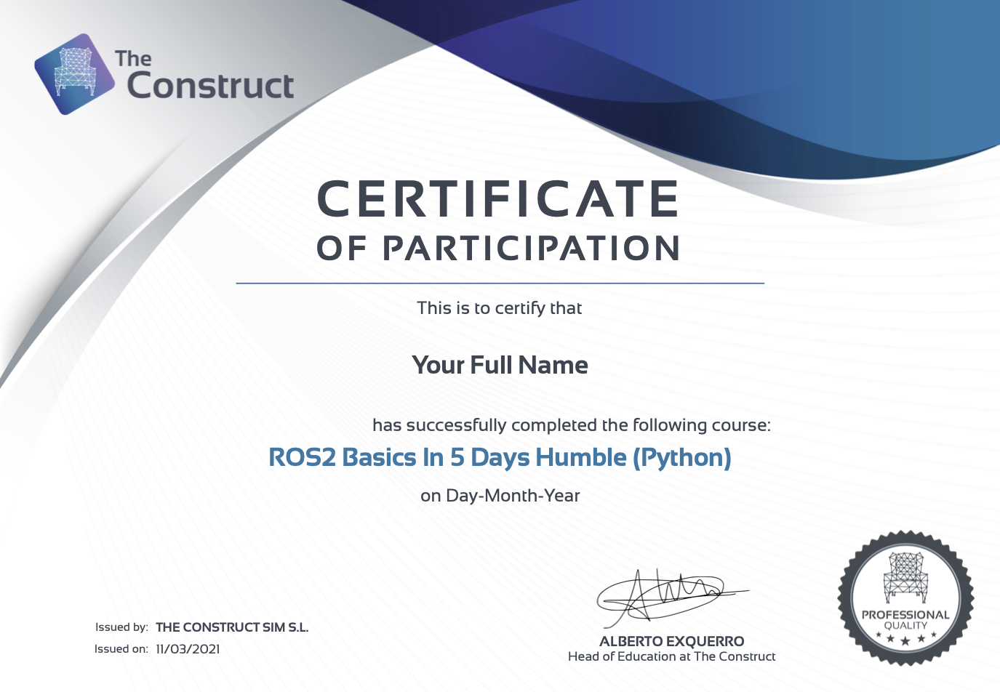

# DAY 1 RANGKUMAN STUDY NOTES BASCORRO INTERNSHIP

Kamis 7 November 2024
https://app.theconstruct.ai/courses/

## PYTHON 3 FOR ROBOTICS

### Unit 1 INTRODUCTION

**Unit 1: Pengantar Kursus**

- **Tujuan**: Kursus ini bertujuan untuk mengajarkan Python sebagai bahasa pemrograman untuk robotika. Dengan mempelajari kursus ini, akan siap melanjutkan ke kursus Robot Ignite Academy lainnya yang berbasis Python.
- **Durasi**: 15 menit

**1.1 Mengapa Belajar Python untuk Robotika?**

- **Popularitas Python di Robotika**: Python adalah bahasa yang sangat populer dalam bidang robotika dan kecerdasan buatan, dengan pustaka seperti OpenAI, Scikit-learn, OpenCV, dan TensorFlow yang sering digunakan untuk pengembangan perangkat lunak robot.
- **Python dalam ROS**: ROS (Robot Operating System) memungkinkan pemrograman robot menggunakan Python, yang membuat pembelajaran dan pengembangan robot menjadi lebih cepat dan mudah.

**1.2 Memulai Praktik: Membuat Program Python Sederhana**

- **Contoh Program Python**: membuat program Python bernama `arm_control.py` untuk mengontrol lengan robot di simulasi.

  **Langkah-langkah**:

  1. **Buat File**: Buat file bernama `arm_control.py` di folder `src` dalam `catkin_ws`.
  2. **Tulis Kode**: Salin dan tempel kode berikut di dalam file tersebut:

     ```python
     from smart_grasping_sandbox.smart_grasper import SmartGrasper
     from tf.transformations import quaternion_from_euler
     from math import pi
     import time

     sgs = SmartGrasper()
     sgs.pick()
     sgs.reset_world()
     ```

  3. **Jalankan Program**: Buka terminal, pastikan berada di direktori file (`/home/user/catkin_ws/src`), lalu jalankan perintah:
     ```bash
     python arm_control.py
     ```
     Lengan robot di simulasi akan bergerak dan mengambil bola merah.

**1.3 Konsep Dasar Python yang Dipelajari**
Beberapa konsep Python yang dipelajari dalam kursus ini mencakup:

- **Menyimpan Data dalam Variabel**

  - **Penjelasan**: Variabel adalah tempat untuk menyimpan data yang dapat digunakan dan dimanipulasi dalam program.
  - **Contoh**:

    ```python
    # Menyimpan angka dalam variabel
    kecepatan_robot = 10  # integer

    # Menyimpan teks dalam variabel
    nama_robot = "Summit XL"  # string

    # Menyimpan hasil perhitungan dalam variabel
    waktu_tempuh = jarak / kecepatan_robot  # float
    ```

  - **Catatan**: Variabel di Python bersifat dinamis, artinya tidak perlu mendeklarasikan tipe datanya terlebih dahulu. Python akan mengenali tipe data berdasarkan nilai yang berikan.

- **Mengoperasikan Data dalam Variabel**

  - melakukan operasi matematika atau logika pada variabel:

    ```python
    # Operasi aritmatika
    jarak = 100  # dalam satuan meter
    waktu = jarak / kecepatan_robot  # waktu = jarak / kecepatan

    # Operasi logika
    if waktu < 5:
        print("Robot akan sampai dalam waktu kurang dari 5 detik.")
    ```

- **Menggunakan Kondisi**

  - Kondisi memungkinkan program menjalankan perintah yang berbeda berdasarkan situasi tertentu.
    ```python
    if kecepatan_robot > 5:
        print("Robot bergerak cepat.")
    else:
        print("Robot bergerak lambat.")
    ```

- **Membuat Metode (Fungsi)**

  - Fungsi adalah blok kode yang dapat dipanggil dari bagian lain dalam program.

    ```python
    def gerakkan_robot(kecepatan):
        print(f"Robot bergerak dengan kecepatan {kecepatan} m/s")

    # Memanggil fungsi
    gerakkan_robot(10)
    ```

- **Membuat Kelas dan Objek**

  - Kelas memungkinkan membuat kode yang lebih terstruktur dan modular.

    ```python
    class Robot:
        def __init__(self, nama, kecepatan):
            self.nama = nama
            self.kecepatan = kecepatan

        def perkenalkan(self):
            print(f"Halo, saya {self.nama} dan saya bergerak dengan kecepatan {self.kecepatan} m/s")

    # Membuat objek dari kelas Robot
    robot1 = Robot("Summit XL", 10)
    robot1.perkenalkan()
    ```

**1.4 Metode Pembelajaran**

- **Pembelajaran Berbasis Praktik**: Kursus ini mengutamakan pembelajaran berbasis praktik langsung. akan menggunakan simulasi untuk mempraktikkan konsep-konsep Python dengan robot-robot virtual seperti Summit XL dan Turtlebot.

**1.6 Kesimpulan**

- Pada unit ini,belajar cara membuat dan menjalankan program Python untuk mengontrol lengan robot

### Unit 2 Python Essentials

## ROS2 Basics python

What will you learn with this course?
In this course, you will be presented with the following topics:

Basic Concepts of ROS2: Packages, Launch Files, Nodes, Client Libraries, etc.
How Topics work: Publishers and Subscribers
How Services work: Clients and Servers
How Actions work: Clients and Servers
How to manage Multithreading in ROS2 (Executors and Callback Groups)
Basic Debugging Tools: Logging system, RVIZ2.


