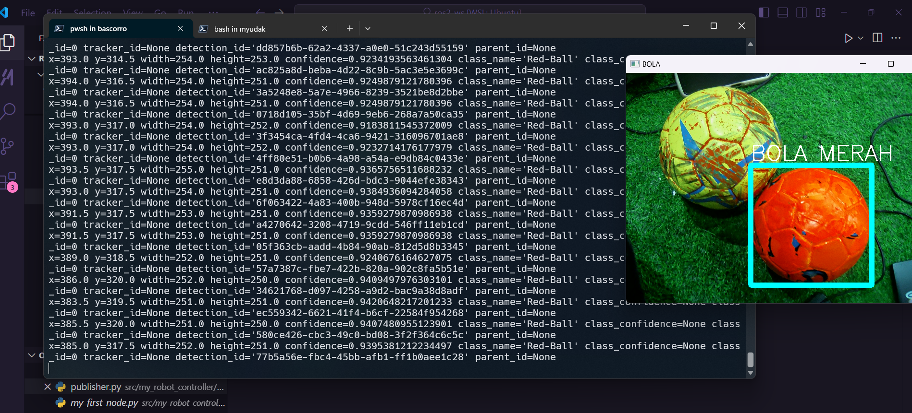

# DAY 8 RANGKUMAN STUDY NOTES BASCORRO INTERNSHIP

Jumat, 11/22/2024

Yes, you can train a model to specifically identify only orange balls, and you can implement strategies to reduce confusion with similar colors, such as yellow.

### Key Steps to Achieve This:

1. **Data Collection and Preprocessing**:

   - Collect a robust dataset of orange balls under various lighting conditions, angles, and environments.
   - Include yellow balls, null objects (other colors or non-ball objects), and background noise to ensure the model learns to differentiate between them.

2. **Labeling**:

   - Label orange balls as positive examples (`orange_ball`) and all others (including yellow balls and nulls) as negative examples (`not_orange_ball`).

3. **Feature Representation**:

   - Ensure your model uses features that can capture the subtle differences between orange and yellow, such as HSV (Hue, Saturation, Value) color space. The Hue in HSV is particularly good for distinguishing colors.

4. **Model Selection**:

   - Use a model architecture suitable for image classification, like a Convolutional Neural Network (CNN).
   - Alternatively, if this is a simpler application, a decision tree or an SVM might suffice if the feature space is well-designed (e.g., color histograms).

5. **Training and Validation**:

   - Use separate datasets for training and validation.
   - Train the model on the labeled data and validate it with images the model hasn’t seen before to check its performance.

6. **Avoiding Confusion**:

   - Emphasize edge cases during training by providing images of orange and yellow balls in challenging scenarios (e.g., under different lighting or with mixed backgrounds).
   - Use data augmentation techniques like brightness adjustments to make the model robust.

7. **Thresholds and Confidence**:
   - Implement a confidence threshold for predictions. For example, the model might predict "orange ball" only if the confidence is above 90%.

### Additional Notes:

- **Color Similarity**: Since orange and yellow are close in the spectrum, you should fine-tune the model carefully to identify specific color nuances.
- **Metrics**: Use metrics like precision, recall, and F1 score to monitor how well the model is distinguishing orange balls.
- **Testing on Yellow and Nulls**: Once trained, test extensively on yellow balls and null objects to ensure minimal false positives.

### Will the Model Be Confused?

If properly trained with a good dataset and preprocessing, the model should not be confused. However, a poorly labeled or insufficient dataset can lead to overlap in learned features, causing misclassifications.

Let me know if you'd like further details on implementation or code samples!
