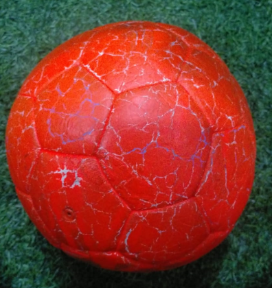
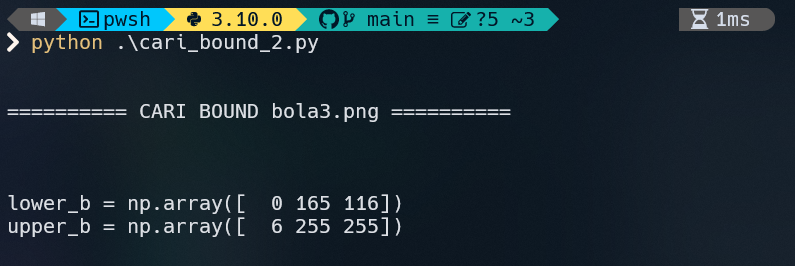
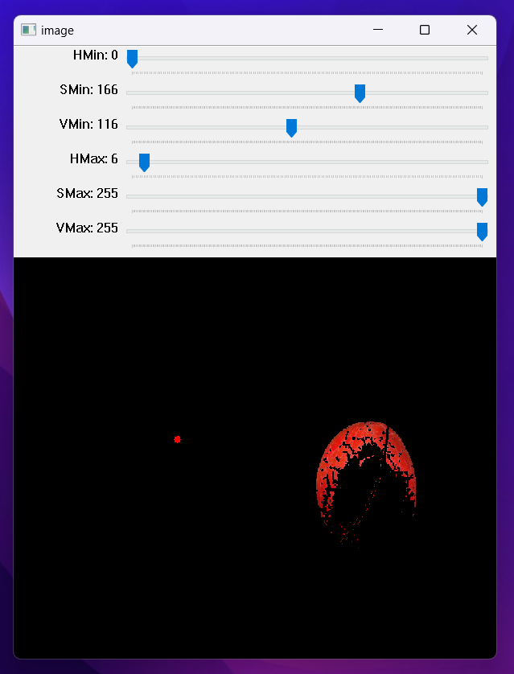
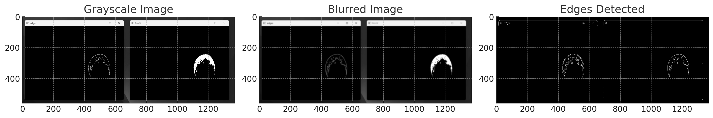
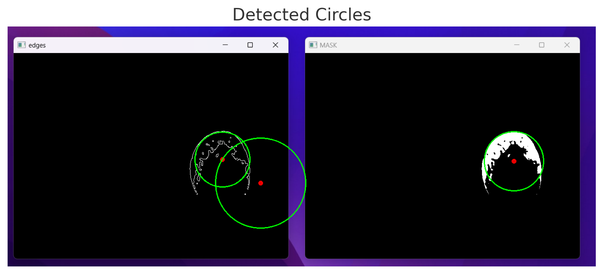

# Ball Detection Using OpenCV

EWS BASCORRO INTERNSHIP PROJECT 1

In this assignment, you will create a program that can detect orange balls in images or videos using OpenCV. The program should be able to find the orange ball and place a mark around it. You can use Python or C++ to create this program, according to your choice. The more creative and complete the program features you create, the higher the grade of your assignment.

Good luck, and show your skills in making color detection using OpenCV!

Finally, submit your ball detection file in the Task Submition.

## PROJECT

HSV mask -> Hough Circle

### 1. Find Lower Upper Bound for HSV PARAM

```bash
python cari_bound.py
```

```bash
python cari_bound_2.py
```





### 2. Find Hough Circle PARAM

```bash
python tuning_houghCircle.py
```




### CODE

#### import lib

```python
import cv2
import numpy as np
```

#### CONSTANT Config

```python
LOWER_B = np.array([0, 165, 116])
UPPER_B = np.array([6, 255, 255])
MERAH = (0, 0, 255)
KERNEL_BLUR = (9, 9)
CIRCLE_DP = 1.2
CIRCLE_MIN_DIST = 100
CIRCLE_PARAM1 = 50
CIRCLE_PARAM2 = 30
CIRCLE_MIN_RADIUS = 30
CIRCLE_MAX_RADIUS = 200
```

#### Debug Print

```python
print("\n\n========== myudakk ==========")

cap = cv2.VideoCapture(int(input("Video Capture (0,1,2,3) > ")))

print(f"LOWER_BOUND = np.array({LOWER_B.tolist()})")
print(f"UPPER_BOUND = np.array({UPPER_B.tolist()})")
print(f"KERNEL BLUR = {KERNEL_BLUR}")
print(f"CIRCLE_DP = {CIRCLE_DP}")
print(f"CIRCLE_MIN_DIST = {CIRCLE_MIN_DIST}")
print(f"CIRCLE_PARAM1 = {CIRCLE_PARAM1}")
print(f"CIRCLE_PARAM2 = {CIRCLE_PARAM2}")
print(f"CIRCLE_MIN_RADIUS = {CIRCLE_MIN_RADIUS}")
print(f"CIRCLE_MAX_RADIUS = {CIRCLE_MAX_RADIUS}")
print("q || CTRL + C to exit")
```

#### Main Code

while true read frame video

```python
try:
    while 1:
        ret, frame = cap.read()
        if not ret:
            print("GAK AD VIDEOO")
            break
```

#### Convert to hsv

frame blur biar lebih halus

```python
        hsv = cv2.cvtColor(
            cv2.GaussianBlur(frame, KERNEL_BLUR, 0),
            cv2.COLOR_BGR2HSV,
        )
        mask = cv2.inRange(hsv, LOWER_B, UPPER_B)
```

#### Apply Hough Circle

init Hough Circle

```python
        circles = cv2.HoughCircles(
            mask,
            cv2.HOUGH_GRADIENT,
            dp=CIRCLE_DP,
            minDist=CIRCLE_MIN_DIST,
            param1=CIRCLE_PARAM1,
            param2=CIRCLE_PARAM2,
            minRadius=CIRCLE_MIN_RADIUS,
            maxRadius=CIRCLE_MAX_RADIUS,
        )
```

if ada circle, setiap circles buletin

```python
        if circles is not None:
            circles = np.uint16(np.around(circles))
            for circle in circles[0, :]:
                x, y, radius = circle
                cv2.circle(frame, (x, y), radius, MERAH, 2)
                cv2.circle(frame, (x, y), 3, MERAH, -1)
```

#### Show

```python
        cv2.imshow("MASK", mask)
        cv2.imshow("MAIN", frame)
```

#### END

```python
        if cv2.waitKey(1) == ord("q"):
            break

except KeyboardInterrupt:
pass

print("========== myudakk ==========\n\n")
print("exit...")
cap.release()
```
