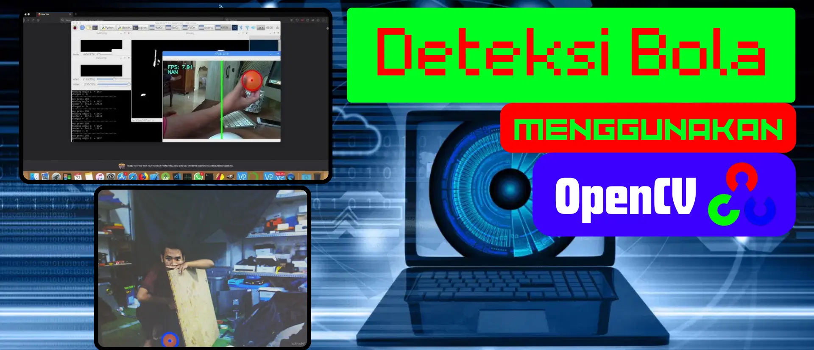

https://trello.com/c/76iodszm/9-ball-detection-using-opencv

# Ball Detection Using OpenCV

In this assignment, you will create a program that can detect orange balls in images or videos using OpenCV. The program should be able to find the orange ball and place a mark around it. You can use Python or C++ to create this program, according to your choice. The more creative and complete the program features you create, the higher the grade of your assignment.

Good luck, and show your skills in making color detection using OpenCV!

Finally, submit your ball detection file in the Task Submition.
