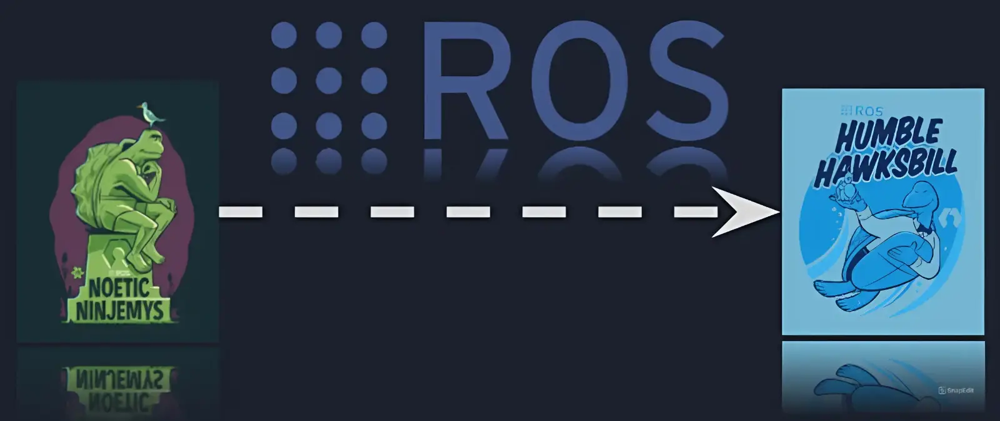

https://trello.com/c/f7nOWBAr/8-ros1-to-ros2-migration-project

# ROS1 to ROS2 Migration Project

This time you will make a project of migration ROS1 Noetic into ROS2 Humble. We will give you a ROS1 workspace below and your task is to make a version of ROS2 workspace. There are Python and C++ programming language you can freely choose to migrate. So, before you work on this project, make sure to learn about ROS1 and ROS2 fundamental first.

Furthermore, submit your ROS2 migration workspace in the task submition card at the right end of this Trello workspace.

Format Submition: your_name_migrate_ws.zip

https://github.com/ProgramBascorro/Exrec_Program_Bascorro_2025
